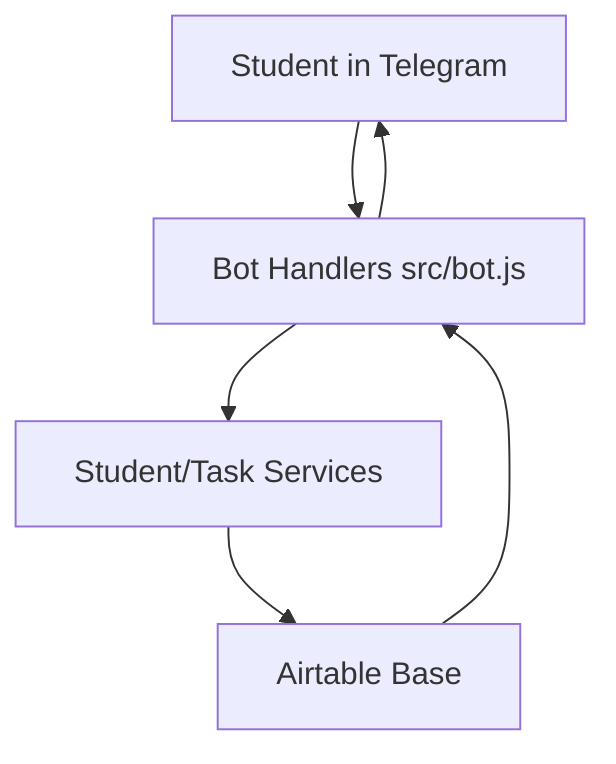
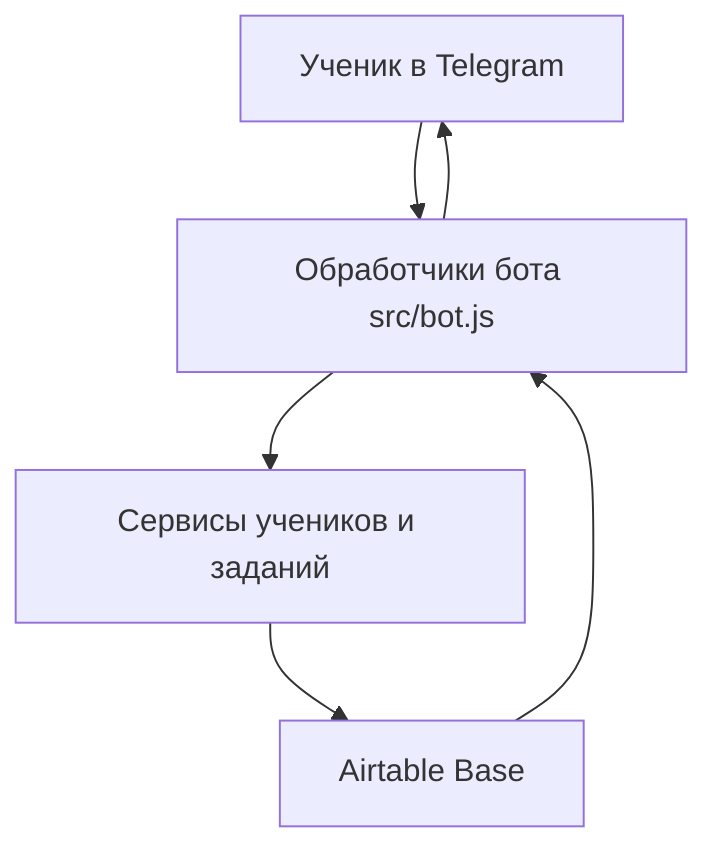

# Telegram Edu Bot

## English

## Problem
Teachers need a simple way to distribute lessons and tasks in Telegram while managing educational data without editing code.

## Solution
This bot integrates Telegram with Airtable so students receive tasks in chat and teachers manage curriculum content in Airtable tables.

## Tech Stack
- Node.js
- JavaScript (ESM)
- `node-telegram-bot-api`
- Airtable SDK
- dotenv

## Architecture
Top-level structure:
```text
src/
package.json
Procfile
```



## Features
- Telegram bot user flows (`/start`, lesson/task interactions)
- Student registration flow
- Task retrieval and answer checking
- Airtable-backed lesson and progress data

## How to Run
```bash
yarn install
cp .env.example .env
yarn start
```

Required variables: `TELEGRAM_BOT_TOKEN`, `AIRTABLE_API_KEY`, `AIRTABLE_BASE_ID`.

## Русский

## Проблема
Учителям нужен простой способ выдавать уроки и задания в Telegram, управляя контентом без правки кода.

## Решение
Бот связывает Telegram и Airtable: ученики получают задания в чате, а учитель управляет учебными данными в Airtable.

## Стек
- Node.js
- JavaScript (ESM)
- `node-telegram-bot-api`
- Airtable SDK
- dotenv

## Архитектура
Верхнеуровневая структура:
```text
src/
package.json
Procfile
```



## Возможности
- Сценарии взаимодействия в Telegram (`/start`, уроки, задания)
- Процесс регистрации ученика
- Выдача задач и проверка ответов
- Хранение учебных данных в Airtable

## Как запустить
```bash
yarn install
cp .env.example .env
yarn start
```

Обязательные переменные: `TELEGRAM_BOT_TOKEN`, `AIRTABLE_API_KEY`, `AIRTABLE_BASE_ID`.
